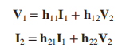
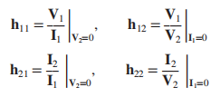
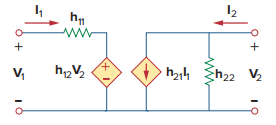
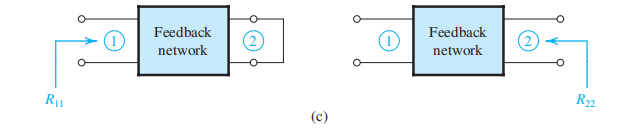
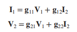
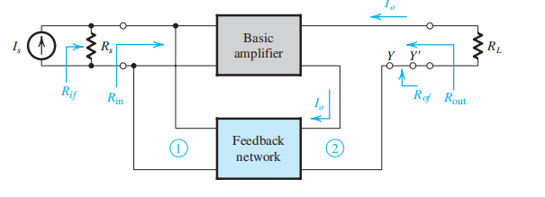
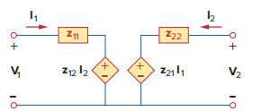
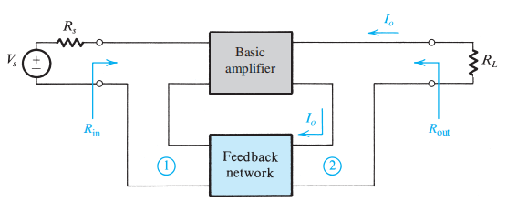
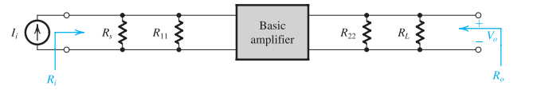
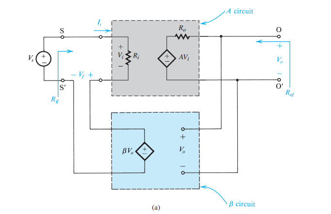

# 运用二端口网络解释拆环

为了更好地了解拆环背后的原理，我阅读了《Fundamentals of Electric Circuits》的第19章“Two-Port Networks”，自学了二端口网络的相关知识后，决定从“混合参数”（H参数）、“导纳参数（Y参数）”、“阻抗参数（Z参数）”用来解释拆环方法：

- 画输入，看输出：输出端如果是电压采样，则将输出端对地短路；输出端如果是电流采样，则将输出端开路。

- 画输出，看输入：输入端如果是并联接入，则将输入端对地短路；输入端如果是串联接入，则将输入端开路。

这个拆环方法整体上可以总结为：

- 并联接法的，则将两端短路。
- 串联解法的，则将两端开路。

下面我将从二端口网络出发，解释开环方法的原理。

## 1.1 混合参数（H参数）

H参数将用来解释电压串联负反馈的拆环原理。
首先考虑如下的二端源网络：

用H参数描述的公式如下：

其中，\(h_{11}\)\(h_{12}\)\(h_{21}\)\(h_{22}\)可以通过如下表达式求出：

从中可以看出，\(h_{11}\)的量纲与电阻相同，\(h_{22}\)的量纲与电导相同，于是可以运用戴维南等效与诺顿等效的表示方法，将该二端口网络等效为如下形式：

若将右端看作反馈电路的输入端，将左端看作反馈电路的输出端，其中，电导\(h_{22}\)所对应的电阻两端的电压即为\(V2\)，整个反馈电路则可以看作输入\(V_{2}\)的电压，输出\(V_{1}\)的电压。所以若将这个反馈电路接入放大电路，则可以看作是一个电压串联负反馈。从接入方式上来看，放大器输入端反馈电路串联的接法与戴维南等效相对应，而输出端反馈电路并联的接法也与诺顿等效相对应。
因此整个放大器+反馈回路可以等效为如下的电路：

值得一提的是，从等效图中我们也能看到放大器的输入端通过反馈网络对放大器的输出端产生影响（\(h_{21}I_{1}\)）。通过二端口网络等效的方法，我们就可以得出反馈网络的输入电阻和输出电阻的大小，从图中可以得出：

\[R_{F,out}=h_{11}\]

\[R_{F,in}=\frac{1}{h_{22}}\]

到这里我们已经利用二端口网络的等效初步完成了拆环。接下来，为了考虑反馈电路对放大器输入输出电阻的加载效应，我们将\(h_{11}\)和\(h_{22}\)分别放入放大器的输入与输出回路，就得到了如下图所示的电路：

到这一步我们就已经实现了将原电路等效为理想的反馈电路结构。但是请注意，因为此时反馈网络的输入电流与输出电压都已经发生了改变，所以事实上反馈网络与反馈因子都发生了改变，与原有的反馈网络并不等价。不过在接下来的证明中我们可以说明反馈因子在这个转换的过程中近似不变。
**证明：**

*证明1：* 对比上图所示转换前和转换后的反馈系数，转换前的反馈因子多了一个\(I_1\)的影响。然而，对于一般的放大器，其\(R_{in}\)一般较大，这就使得\(I_{1}\)较小，可以近似认为趋于0，那么转换前后的反馈系数就可以近似认为不变。
*证明2：* 若从反馈网络自身的角度看，由于在反馈网络中，我们更关注放大器输出端对输入端的反馈作用，进而可以忽略放大器的输入端通过反馈网络对放大器的输出端产生的影响，所以可以近似认为\(I_{1}=0\)，那么反馈系数也近似不变。
**证毕**
于是我们完成了在不考虑信号源内阻和负载时的拆环，并且确保了在这个过程中反馈因子基本不变。若考虑负载与信号源电阻的影响，就得到了《Microelectronics Circuits》中P832的图（b），其中，\(R_{11}\)对应于\(h_{11}\)(即\(R_{F,out}\))，\(R_{22}\)对应于\(\frac{1}{h_{22}}\)(即\(R_{F,in}\))。至此也就完成了拆环。

接下来的一步是求出\(h_{11}\)与\(h_{22}\)。若能求出，则求出了\(R_{11}\)与\(R_{22}\)。回顾在二端口网络中求\(h_{11}\)与\(h_{22}\)的方法：

从上述式子中可以得出，求\(h_{11}\)时，要求\(V_{2}=0\)，即另一端短接；求\(h_{22}\)时，要求\(I_{1}=0\)，即另一端开路。这也就对应了：

- 画输入，看输出：输出端如果是电压采样（并联接入），则将输出端对地短路；输出端如果是电流采样（串联接入），则将输出端开路。

- 画输出，看输入：输入端如果是并联接入，则将输入端对地短路；输入端如果是串联接入，则将输入端开路。

这一方法对应于《Microelectronics Circuits》中P832的图（c）：

至此，通过二端口网络中的H参数，我们解释了电压串联负反馈的拆环原理。

## 1.2 混合参数（G参数）

G参数将用来解释电流并联负反馈的拆环原理。
若将二端口网络的左端用诺顿等效，右端用戴维南等效，则可以将二端口电路等效为如下电路：

此时\(V_{1}\)\(I_{1}\)\(V_{2}\)\(I_{2}\)满足用G参数描述的方程组：

仿照1.1中的讨论，该二端口网络可以描述电流并联负反馈的反馈网络，反馈输入端（右端）输入大小为\(I_{2}\)的电流，反馈输出端输出大小为\(-I_{1}\)的电流。将该二端口反馈网络接入如《Microelectronics Circuits》中P866的图（a）所示的放大器：

则可以得到如P865和P866所示的放大电路与反馈电路：

接法为电流并联接入。其中，\(R_{11}\)对应于二端口网络中的\(\frac{1}{g_{11}}\),\(R_{22}\)对应于二端口网络中的\({g_{22}}\)。与在1.1中\(I_{1}\)近似为0相似，在这里我们将\(V_{1}\)近似为0（忽略放大器输入端通过反馈对放大器输出端的影响）（这也并联接入之后输入电阻因并联而大幅度减小相对应）。由\({g_{22}}\)\(g_{11}\)的求法可知，求\({g_{22}}\)，需使\(V_{1}=0\)，即反馈输出端短路；求\({g_{11}}\)，需使\(I_{2}=0\)，即反馈输入端开路，这也正反映了开环的方法：

- 画输入，看输出：输出端如果是电压采样（并联接入），则将输出端对地短路；输出端如果是电流采样（串联接入），则将输出端开路。

- 画输出，看输入：输入端如果是并联接入，则将输入端对地短路；输入端如果是串联接入，则将输入端开路。

## 1.3 阻抗参数（Z参数）

Z参数将用来解释电流串联负反馈的拆环原理。
Z参数的定义为：

其中参数的求法为：

因此其等效电路可以表示为：

由Z参数的求法可知，\(z_{11}\)，\(z_{22}\)的量纲均与电阻相同，所以可以看作电阻。等效电路两端均采用戴维南等效。若将该二端口网络作为反馈网络接入如《Microelectronics Circuits》中P845的图（a）所示的放大器（电流串联负反馈）：

则可以得到如P846和P845所示的放大电路与反馈电路：

其中，\(R_{11}\)对应于二端口网络中的\(z_{11}\),\(R_{22}\)对应于二端口网络中的\(z_{22}\)。与在1.1中\(I_{1}\)近似为0相似，在这里我们将\(I_{1}\)近似为0（忽略放大器输入端通过反馈对放大器输出端的影响）（这也与放大器输入电阻较大导致输入电流趋于0相对应）。由\({z_{22}}\)\(z_{11}\)的求法可知，求\({z_{22}}\)，需使\(I_{1}=0\)，即反馈输出端开路；求\({z_{11}}\)，需使\(I_{2}=0\)，即反馈输入端开路，这也正反映了开环的方法：

- 画输入，看输出：输出端如果是电压采样（并联接入），则将输出端对地短路；输出端如果是电流采样（串联接入），则将输出端开路。

- 画输出，看输入：输入端如果是并联接入，则将输入端对地短路；输入端如果是串联接入，则将输入端开路。

## 1.4 导纳参数（Y参数）

Y参数将用来解释电压并联负反馈的拆环原理。
Y参数的定义为：

Y参数的求法为：

Y参数的等效电路如下：

由Y参数的求法可知，\(y_{11}\)，\(y_{22}\)的量纲均与电导，所以等效电路两端均采用诺顿等效。若将该二端口网络作为反馈网络接入如《Microelectronics Circuits》中P857的图（a）所示的放大器（电压并联负反馈）：

则可以得到如P857和P856所示的放大电路与反馈电路：

其中，\(R_{11}\)对应于二端口网络中的\(\frac{1}{z_{11}}\),\(R_{22}\)对应于二端口网络中的\(\frac{1}{z_{22}}\)。与在1.2中\(V_{1}\)近似为0相似，在这里我们将\(V_{1}\)近似为0（忽略放大器输入端通过反馈对放大器输出端的影响）（这也并联接入之后输入电阻因并联而大幅度减小相对应）。由\({g_{22}}\)\(g_{11}\)的求法可知，求\({g_{22}}\)，需使\(V_{1}=0\)，即反馈输出端短路；求\({g_{11}}\)，需使\(V_{2}=0\)，即反馈输入端短路，这也正反映了开环的方法：

- 画输入，看输出：输出端如果是电压采样（并联接入），则将输出端对地短路；输出端如果是电流采样（串联接入），则将输出端开路。

- 画输出，看输入：输入端如果是并联接入，则将输入端对地短路；输入端如果是串联接入，则将输入端开路。

## 1.5 总结

综上所述，利用二端口网络拆环的方法可以看作现根据反馈网络与放大器的连接方式（并联——诺顿等效；串联——戴维南等效）确定等效电路及其二端口参数。接入之后，需要对电路做一个近似等效，得到放大器与反馈网络的理想结构（ideal structure）：

- 电压串联（Series-Shunt）：

- 电流串联（Series-Series）：

- 电压并联（Shunt-Shunt）：

- 电流并联（Shunt-Series）：

端口的等效方式（诺顿等效/戴维南等效）决定了\(R_{F,out}\)与\(R_{F,in}\)是并联还是串联接入，而其求法取决于其二端口网络参数的求法。正是这求法决定了《Microelectronics Circuits》介绍的开环的方法。

